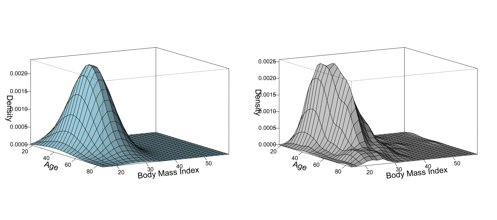

# Initialization

To initialize the program, the following packages are required:

| Package | Comment |
|:--------|:--------|
| MASS    | `kde2d()` |
| Rcpp    | `cppFunction()`   |
| mvtnorm | `dmvnorm()`       |


```r
source("utils.R")
library(MASS)
library(mvtnorm)
```

# A Simple Walk through

In this section we will illustrate the two dimensional case of the folded normal distribution.

## Simulation Data Generation


```r
set.seed(123)
n <- 100
u1 <- 4
u2 <- 6
sig1 <- 1
sig2 <- 2
rho <- 0.2
mean <- c(u1, u2)
sigma2 <- matrix(c(
                sig1^2,             rho * sig1 * sig2,
                rho * sig1 * sig2,  sig2^2),
                2, 2)
dat <- mvrnorm(n, mean, sigma2)
```

## BFGS Optimization

We use Cholsky decomposition to initialize the parameters.


```r
covmat <- cov(dat)
init <- c(mean(dat[, 1]), mean(dat[, 2]), chol(covmat)[c(1, 3, 4)])
inputx <- abs(dat)
```

The following is the result of the optimization.


```r
result <- optim(init, loglik.G2cholesky, method = "BFGS")
print(result)
```

```
## $par
## [1] 4.1273896 6.1666814 0.9701374 0.4121426 1.7639570
## 
## $value
## [1] 337.4436
## 
## $counts
## function gradient 
##       36        9 
## 
## $convergence
## [1] 0
## 
## $message
## NULL
```

The following is the result of the optimization.


```r
## Estimations
print(result$par)
```

```
## [1] 4.1273896 6.1666814 0.9701374 0.4121426 1.7639570
```

```r
## Covariance Matrix
est_helper.G2(result$par, method = "chole")[["sigma2"]]
```

```
##           [,1]      [,2]
## [1,] 0.9411666 0.3998349
## [2,] 0.3998349 3.2814058
```

# Multi-dimensional case

## 2d FN MLE simulation

One could change the settings to the following value and try again.

- n = 20,30,40,50,60,70,80,90,100; 
- mu = (2.5,2.5),(5,5),(7.5,7.5),(10,10),(12.5,12.5).


```r
set.seed(123456)
simu_n <- 1000
dim_p <- 2
result_df <- data.frame()
n <- 20
mu <- c(2.5, 2.5)
ss <- matrix(c(25, 5, 5, 25), 2, 2)
lower_idx <- f_lower_idx(dim_p)
for (i in seq_len(simu_n)) {
    dat <- mvrnorm(n, mu, ss)
    inputx <- abs(dat)
    sss <- cov(dat)
    init <- c(
        mean(dat[, 1]), mean(dat[, 2]),
        sss[lower_idx]
    )
    fit <- optim(init, loglik.G2, method = "BFGS", hessian = TRUE)
    fisher_info <- solve(fit$hessian)
    prop_sigma <- sqrt(diag(fisher_info))
    prop_sigma <- diag(prop_sigma)
    a <- diag(prop_sigma)
    prop_sigma <- a
    upper <- fit$par + 1.96 * prop_sigma
    lower <- fit$par - 1.96 * prop_sigma
    true_para <- c(mu, ss[lower_idx])
    p <- c()
    for (k in 1:5) {
        p[k] <- (lower[k] <= true_para[k] & true_para[k] <= upper[k])
    }
    result_df <- rbind(result_df, p)
}
## calculate coverage rate of parameters ##
# Be sure to handle NA's before the
# coverage rate calculation
result_df[is.na(result_df)] <- FALSE
p <- apply(result_df, 2, mean)
names(p)=c("mu1","mu2","sigma11","sigma21","sigma22")
round(p, 2)
```

```
##     mu1     mu2 sigma11 sigma21 sigma22 
##    0.68    0.67    0.71    0.75    0.69
```

Here:

- n: samples size
- simu_n: simulation times

The coverage rate of parameters are:

| n | simu_n   |   mu1   |     mu2     |   sigma11   | sigma21   | sigma22 |
|--:|---------:|--------:|------------:|------------:|----------:|--------:|
|20 |1000      |0.68     |0.67         |0.71         |0.75       |0.69     |


## 4d FN MLE simulation

We should point out that the speed of dim = 4 is much slower than dim = 2.


```r
set.seed(123456)
simu_n <- 1000
dim_p <- 4
result_df <- data.frame()
n <- 20
mu <- c(2.5, 2.5, 2.5, 2.5)
ss <- matrix(5, 4, 4)
diag(ss) <- 25
lower_idx <- f_lower_idx(dim_p)
for (i in seq_len(simu_n)) {
    dat <- mvrnorm(n, mu, ss)
    inputx <- abs(dat)
    sss <- cov(dat)
    init <- c(
        mean(dat[, 1]), mean(dat[, 2]), mean(dat[, 3]), mean(dat[, 4]),
        sss[lower_idx]
    )
    fit <- optim(init, loglik.G2, method = "BFGS", hessian = TRUE)
    fisher_info <- solve(fit$hessian)
    prop_sigma <- sqrt(diag(fisher_info))
    prop_sigma <- diag(prop_sigma)
    a <- diag(prop_sigma)
    prop_sigma <- a
    upper <- fit$par + 1.96 * prop_sigma
    lower <- fit$par - 1.96 * prop_sigma
    true_para <- c(mu, ss[lower_idx])
    #c(lower[1], upper[1], lower[2], upper[2], (lower[3]),
    #  upper[3], (lower[4]), (upper[4]), (lower[5]), (upper[5]))
    p <- rep(0., 14)
    for (k in seq_len(14)) {
        p[k] <- (lower[k] <= true_para[k] & true_para[k] <= upper[k])
    }
    result_df <- rbind(result_df, p)
}
## calculate coverage rate of parameters ##
# Be sure to handle NA's before the
# coverage rate calculation
result_df[is.na(result_df)] <- FALSE
p <- apply(result_df, 2, mean)
names(p)=c("mu1","mu2","mu3","mu4","sigma11","sigma21","sigma22","sigma31","sigma32","sigma33","sigma41","sigma42","sigma43","sigma44")
round(p, 2)
```

```
##     mu1     mu2     mu3     mu4 sigma11 sigma21 sigma22 sigma31 sigma32 sigma33 sigma41 sigma42 sigma43 sigma44 
##    0.67    0.68    0.66    0.66    0.73    0.76    0.75    0.76    0.72    0.77    0.78    0.70    0.77    0.72
```

Here the coverage rate of parameters are (n = 20, simu_n = 1000) vs (n = 100, simu_n = 100). 

|  n|  simu_n| mu1 | mu2 | mu3 | mu4 | sigma11 |sigma21 |sigma22 |sigma31 |sigma32 |sigma33 |sigma41 |sigma42 |sigma43 |sigma44 | 
|--:|-------:|----:|----:|----:|----:|--------:|-------:|-------:|-------:|-------:|-------:|-------:|-------:|-------:|-------:|
|20 |    1000|0.67 |0.68 |0.66 |0.66 |0.73     |0.76    |0.75    |0.76    |0.72    |0.77    |0.78    |0.70    |0.77    |   0.72 |


> ⚠ It is noticable the number of parameters is 14, which is much larger than the number of parameters in the 2d case. Therefore, the number of observations n should be larger than dim=2's to get a reasonable coverage rate.

# Real data example

We use the `bmi.nz` data in the `VGAM` package as an example. It is the body mass indexes and ages from an approximate random sample of 700 New Zealand adults.


```r
source("utils.R")
library(MASS)
library(ggplot2)
library("shape")
library("MASS")

## R package VGAM bmi data
data <- VGAM::bmi.nz
## For users' convinience, we provide the tab separated data file as well
## data <- read.csv("bmi.csv", header = TRUE, sep = " ")[, c(2, 3)]
colnames(data) <- c("age", "bmi")
## kernel density estimate ##
kde_estimation <- kde2d(data[, 1], data[, 2])
length(kde_estimation$x)
dim(kde_estimation$z)
## estimate mle ##
dat <- data.frame(data$age, data$bmi)
dat <- as.matrix(data)
inputx <- dat
sss <- chol(cov(dat))
init <- c(
    mean(dat[, 1]), mean(dat[, 2]),
    sss[c(1, 3, 4)]
)
fit <- optim(init, loglik.G2cholesky, hessian = T)
muest <- fit$par[c(1, 2)]
sigma <- matrix(c(fit$par[3], 0, fit$par[4], fit$par[5]), 2, 2)
fisher_info <- solve(fit$hessian)
prop_sigma <- sqrt(diag(fisher_info))
prop_sigma <- diag(prop_sigma)
a <- diag(prop_sigma)
prop_sigma <- a
sigmaest <- t(sigma) %*% sigma
x <- seq(min(data$age), max(data$age), length.out = 25)
y <- seq(min(data$bmi), max(data$bmi), length.out = 25)
mu1 <- muest[1]
mu2 <- muest[2]
sgm1 <- sqrt(sigmaest[1, 1])
sgm2 <- sqrt(sigmaest[2, 2])
rou <- sigmaest[1, 2] / (sgm1 * sgm2)

f1 <- function(x, y) {
    (1.0 / (2.0 * pi * sgm1 * sgm2 * sqrt(1 - rou^2))
    ) * (exp((-1.0 / (2.0 * (1 - rou^2))) * ((((x - mu1)^2) / (sgm1^2)) - 
        (2 * rou * (x - mu1) * (y - mu2) / (sgm1 * sgm2)) + (((y - mu2)^2) / sgm2^2))) + 
            exp((-1.0 / (2.0 * (1 - rou^2))) * ((((x + mu1)^2) / (sgm1^2)) - 
                (2 * rou * (x + mu1) * (y - mu2) / (sgm1 * sgm2)) + (((y - mu2)^2) / sgm2^2)))
                    + exp((-1.0 / (2.0 * (1 - rou^2))) * ((((x - mu1)^2) / (sgm1^2)) - 
                    (2 * rou * (x - mu1) * (y + mu2) / (sgm1 * sgm2)) + (((y + mu2)^2) / sgm2^2))) + 
                        exp((-1.0 / (2.0 * (1 - rou^2))) * ((((x + mu1)^2) / (sgm1^2)) - (2 * rou * (x + mu1) * (y + mu2) / 
                            (sgm1 * sgm2)) + (((y + mu2)^2) / sgm2^2))))
}

z <- outer(x, y, f1) # generate pdf of folded normal
png("figure/combined_plot.png", width = 18, height = 8, units = "in", res = 300)
layout(matrix(c(1, 2), nrow = 1))
par(mgp = c(3, 2, 5))
persp(x, y, z, theta = 60, phi = 10, expand = 0.6, r = 180, ltheta = 0, shade = 0.5,
    ticktype = "detailed", xlab = "Age", ylab = "Body Mass Index", zlab = "Density",
    col = "lightblue", main = "", cex.axis = 1.25, cex.lab = 1.75)
par(mgp = c(3, 2, 5))
persp(kde_estimation$x, kde_estimation$y, kde_estimation$z, theta = 60, phi = 10,
    expand = 0.6, r = 180, ltheta = 0, shade = 0.5,
    ticktype = "detailed", xlab = "Age", ylab = "Body Mass Index",
    zlab = "Density", col = "lightgray", main = "", cex.axis = 1.25, cex.lab = 1.75)
dev.off()
```

Check the figures as follows. 

- The left figure is the estimated density surface of the proposed MLE. 
- The right figure is the estimated density surface of the kernel density estimation.




# Notice

> ⚠ In `utils.R`, the `loglik.G2()` and `loglik.G2cholesky()` functions use the **global** varibale `inputx`, which stores the data in a matrix format. Therefore, the user should be careful when using these two functions.
> Especially, the user should make sure that:
> - the `inputx` is updated before calling these two functions;
> - parrallel computing does not work properly with these two functions, i.e. be sure to run the demo code in a sequential way.
