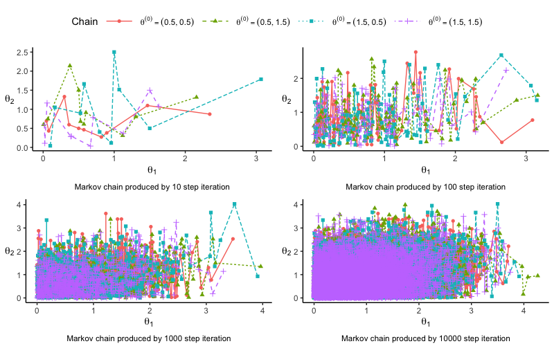
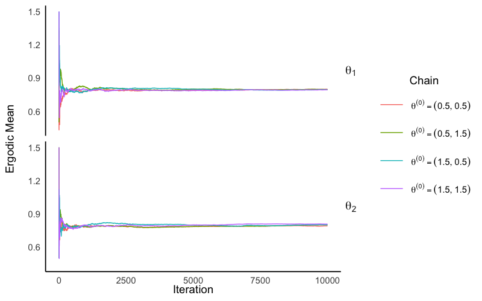
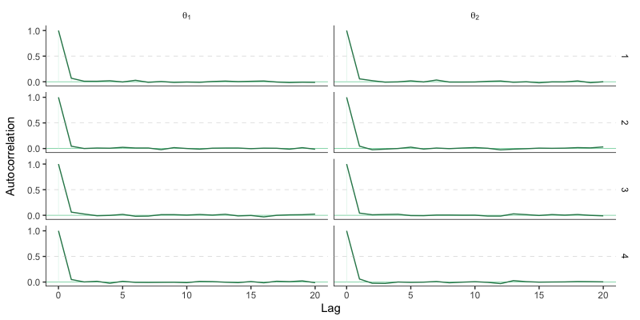
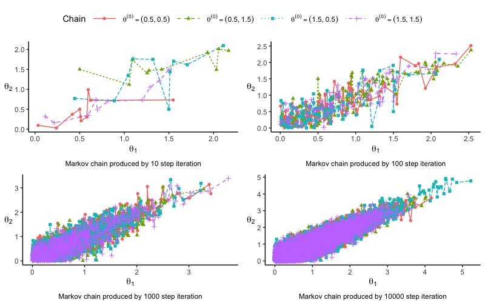

# Folded Normal RNG & MLE

| Desc | logs |
|:-----|:-----|
| Package | rfnorm |
| maintainer  | Yifan Yang <mailto: yfyang.86@hotmail.com> |
| Version | 0.1-3 |
| Date | 2023-01-20 |

A multivariate folded normal distribution is a distribution of the absolute value of a Gaussian random vector. In thie repo, we provide several instances to generate multivariate folded normal random numbers.

Besides, we provide MLE for folded normal in this package as well. By using `form_opt`, one might always try the default setting first. If the result does not converge, one could move to `control=list(initlevel = -1)` option. 

| Item | Context |
|:----|:---------|
| cmt_opt	| Folded Normal MLE-Contraction Mapping Theorem. |
| em_opt	| Folded Normal MLE-EM Algorithm |
| form_opt	| Folded Normal MLE-FORM Algorithm |
| optim_opt | BFGS Optimization |

## Install `rfnorm` package

- Clone `rfnorm`
- Redirect to `rfnorm/Rpack/rfnorm` directory
- Install from `devtools`

```R
libray(devtools)
install()
```

## RNG: Multi dimensions Gibbs Method with naive R

We notice the runningtime is relatively long (0.3977759 secs). Therefore, the `rfnorm` package with a C++ implement is provided (under development).

```R
########################
#### Dimension == 2 ####
########################
set.seed(1234)
#### Dimension == 2 ####
ux = matrix(rnorm(4), 2, 2)
Sig = ux %*% t(ux)
sample_array = mvrfnorm(100,
c(0,0),
Sig,
init=matrix(c(
    0.5, 1.5,
    0.5, 1.5,
    1.5, 0.5,
    1.5, 1.5
    ), byrow = TRUE, ncol = 2), gibbs_chain =  4)
########################
#### Dimension == 5 ####
########################
p = 5
mu = c(0,0,0,0,0)
Sigma = matrix(c(
 2.03699158, -0.08862598, -1.5803865,  0.3423154547,  0.1208288993,
-0.08862598,  3.82704768, -0.1008578, -0.0340634734, -0.0180624431,
-1.58038655, -0.10085779,  1.8784891, -0.6122898668, -0.3254919283,
 0.34231545, -0.03406347, -0.6122899,  0.7448752820,  0.0008840939,
 0.12082890, -0.01806244, -0.3254919,  0.0008840939,  0.9116069671), 
 byrow = T, nrow = 5
)
gibbs_chain = 4
sample_size = 1000
init_mat = matrix(c(
    0.5, 0.5, 1.5, 1.5, 1.0, 
    1.0, 1.5,0.5,1.0, 0.5,
    1.5, 1.0, 1.0, 0.5, 1.5, 
    1.0, 0.5,1.0, 1.0, 1.5
), byrow = T, nrow=4)
sample_array = mvrfnorm(sample_size,
  mu, Sigma, gibbs_length = 1000, 
  init = init_mat, gibbs_chain = 4)$value
     
```

## RNG: Imputation Algorithm

Check [here](./demos/algorithm2/algorithm2.md) for more details.

## MLE: EM/Mapping Theorem and so on

```R
#### A comprehensive example (with bad cases) ####

data = "0.29915438 0.73050182 1.10164877 0.99245103 1.55256409 1.73991549 0.83442530 0.32631165 1.73724989 0.60067424 0.02867189 0.40771091 1.27667327
0.56149257 1.22390030 0.56556088 0.46302718 0.52413419 0.13151042 1.71375044 0.20838342 0.45678946 0.35118717 1.97778518 0.13100859 0.75154644
1.09408190 0.07707610 0.97138785 0.09626559 0.43193309 0.59984521 0.92195587 0.14936359 0.67445330 0.76063709 1.67433467 0.14729671 1.29153017
0.76799642 0.86462658 0.30378158 0.42540649 0.75897836 0.35316591 0.44135864 0.29404000 0.17188241 0.44690563 0.59251636 0.51252526 0.75980156
1.00913421 1.02454388 0.08335193 1.09633118 0.43967218 0.83589682 0.54487146 1.13675810 0.86421222 0.13658047 0.19173575 0.04768809 0.01728665
0.19044665 0.26213912 0.75962072 0.01802486 0.36031671 1.88979266 0.13277477 0.19884376 1.54177736 0.34094181 1.30215179 0.32574376 0.45844715
0.64716393 0.13132711 1.52090336 0.62385327 1.25338920 1.79078203 1.66898127 1.24528151 0.67536357 0.35329484 2.20319925 0.17799416 0.28202090
0.28978792 0.76792726 0.31197285 0.42482144 0.28861050 0.50710386 0.40977282 0.67063552 0.41153347"
x = as.double(unlist(strsplit(data, '\\s')))
cmt_opt(x, c(0.5, 0.5))
#$par
#[1] -0.002694565  0.734747278
#$convergence
#[1] -1
em_opt(x)
# $iters
# [1] 12
# $loglik
# [1] -56.96422
# $param
# mean sigma squared
# 0.2947588     0.6449579
# $convergence
# [1] 0
form_opt(x)
#$par
#[1]  Inf -Inf
#$loglik
#[1] 0.99999
#$convergence
#[1] -1
#$llr
#[1] NaN
form_opt(x, control=list(initlevel = -1))
# $par
# [1] 0.2947588 0.6449579
# $loglik
# [1] 0.4590292
# $convergence
# [1] 0
# $llr
# [1] 0.01058425
```

# RNG performance

## RNG Performance: Test for 2 dimensions Gibbs Method with the `rfnorm` package

```R
#### Load Packages
## Main package
library(rfnorm)
#### Settings ####
N <- 10000 
Chain_n <- 4
Sig = matrix(
  c(1  , 0.5,
    0.5, 1  ), byrow = T, ncol =2)

#### RNG ####
set.seed(1010)

t_start <- Sys.time()

result = mvrfnorm(N,
c(0,0),
Sig,
init=matrix(c(
    0.5, 1.5,
    0.5, 1.5,
    1.5, 0.5,
    1.5,1.5
    ), byrow = T, ncol = 2), gibbs_chain =  4)

t_end <- Sys.time()
t_end - t_start
#> Time difference of 0.02137399 secs

sample_array <- result[["value"]]
```

We find the running time is now 0.02137399 secs comparing to 0.3977759 secs.

For dimension case, `rfnorm` is much faster than the naive R version.

## RNG Illustration: Ergodic Mean Plot

We could verify the RNG (random number generation) quality of the proposed Gibbs by several methods. The following code shows an example to draw the Ergodic mean plot.

One could find more evaluations in the next section, which includes:

- Trace Plot
- Ergodic Mean Plot
- ACF Plot
- [TBD] More is coming...

```R
library(MASS)
library(base)
library(dplyr)
library(rstanarm)
library(bayesplot)
library(ggplot2)
library(purrr)
library(tidyr)
library(reshape2)
library(latex2exp)
library(cowplot)
library(ggpubr)
library(ks)

#### Ergodic Mean Plot ####
## Ergodic data
Chain_Para1_erg <-
  sample_array[,,1] %>%
  as.data.frame() %>%
  mutate(Iteration=seq_len(N)) %>%
  melt(id.vars = "Iteration", measure.vars = paste0("chain:",1:4),variable.name = "Chain",value.name = "Para") %>%
  group_by(Chain) %>%
  mutate(ergodic_mean = cumsum(Para)/seq_len(N),
         Theta = "theta1") %>%
  as.data.frame()
Chain_Para2_erg <-
  sample_array[,,2] %>%
  as.data.frame() %>%
  mutate(Iteration=seq_len(N)) %>%
  melt(id.vars = "Iteration", measure.vars = paste0("chain:",1:4),variable.name = "Chain",value.name = "Para") %>%
  group_by(Chain) %>%
  mutate(ergodic_mean = cumsum(Para)/seq_len(N),
         Theta = "theta2") %>%
  as.data.frame()
Chain_erg <- 
  Chain_Para1_erg %>% 
  rbind(Chain_Para2_erg) %>%
  mutate(Theta_c = recode(Theta,
                          "theta1" = "theta[1]",
                          "theta2" = "theta[2]")
  )
## Implement ergodic mean plot
Chain_erg %>%
  group_by(Chain) %>%
  # top_n(n = -10000, wt = Iteration) %>%
  ggplot(aes(x=Iteration, y=ergodic_mean, colour=Chain, group=Chain)) +
  facet_grid(rows = vars(Theta_c), labeller = label_parsed) +
  geom_line() +
  theme_minimal(base_size = 14) +
  # geom_hline(aes(yintercept = sqrt(2/pi)), linetype = 5, size = 0.3) +
  theme(panel.grid.major =element_blank(), 
        panel.grid.minor = element_blank(),
        panel.background = element_blank(),
        axis.line = element_line(colour = "black"),
        strip.background = element_rect(
          color = "white", fill = "white"),
        panel.grid = element_blank(),
        legend.key = element_rect(
          color = "white", 
          fill = "white"),
        strip.text.y = element_text(size = 15,angle = 0)) +
  theme(axis.title.x = element_text(margin = margin(r = 20)),
        axis.title.y = element_text(margin = margin(r = 15))) +
  theme(legend.key = element_rect(color = NA, fill = NA),
        legend.key.size = unit(35, "pt")) +
  theme(legend.title.align = 0.5) +
  ylab("Ergodic Mean") +
  scale_color_discrete(labels = c(expression(paste(theta^(0)==group("(",list(0.5,0.5),")"))),
                                  expression(paste(theta^(0)==group("(",list(0.5,1.5),")"))),
                                  expression(paste(theta^(0)==group("(",list(1.5,0.5),")"))),
                                  expression(paste(theta^(0)==group("(",list(1.5,1.5),")")))))

```

## An end-to-end example for 5 dimesional case

Here we use `rfnorm` to generate 5  dimensional random numbers and draw its Ergodic Mean Plot.

```R

####Gibbs: dimensionn 5d ####
library(rfnorm)

#### Settings 
p = 5
mu = c(0,0,0,0,0)
Sigma = matrix(c(
 2.03699158, -0.08862598, -1.5803865,  0.3423154547,  0.1208288993,
-0.08862598,  3.82704768, -0.1008578, -0.0340634734, -0.0180624431,
-1.58038655, -0.10085779,  1.8784891, -0.6122898668, -0.3254919283,
 0.34231545, -0.03406347, -0.6122899,  0.7448752820,  0.0008840939,
 0.12082890, -0.01806244, -0.3254919,  0.0008840939,  0.9116069671), 
 byrow = T, nrow = 5
)
gibbs_chain = 4
sample_size = 1000
init_mat = matrix(c(
    0.5, 0.5, 1.5, 1.5, 1.0, 
    1.0, 1.5,0.5,1.0, 0.5,
    1.5, 1.0, 1.0, 0.5, 1.5, 
    1.0, 0.5,1.0, 1.0, 1.5
), byrow = T, nrow=4)


sample_array = mvrfnorm(sample_size,
    mu, Sigma, gibbs_length = 1e4, 
    init = init_mat, gibbs_chain = 4)$value

#### Plot

library(MASS)
library(clusterGeneration)
library(base)
library(dplyr)
library(rstanarm)
library(bayesplot)
library(ggplot2)
library(purrr)
library(tidyr)
library(reshape2)
library(latex2exp)
library(ggpubr)
library(hexbin)

Chain_Para_erg_list = list()

for (i in 1:p){
    Chain_Para_erg_list[[paste("para", i, sep = '')]] <- (
        sample_array[,,i] %>%
          as.data.frame() %>%
          mutate(Iteration=seq_len(sample_size)) %>%
          melt(id.vars = "Iteration", measure.vars = paste0("chain:", 1:gibbs_chain),
               variable.name = "Chain", value.name = "Para") %>%
          group_by(Chain) %>%
          mutate(ergodic_mean = cumsum(Para)/seq_len(sample_size),
                  Theta = paste("theta", i, sep = '')) %>%
          as.data.frame()
    )
}

Chain_erg <- 
  Chain_Para_erg_list[["para1"]] %>% 
  rbind(Chain_Para_erg_list[["para2"]]) %>%
  rbind(Chain_Para_erg_list[["para3"]]) %>%
  rbind(Chain_Para_erg_list[["para4"]]) %>%
  rbind(Chain_Para_erg_list[["para5"]]) %>%
  mutate(Theta_c = recode(Theta,
                          "theta1" = "theta[1]",
                          "theta2" = "theta[2]",
                          "theta3" = "theta[3]",
                          "theta4" = "theta[4]",
                          "theta5" = "theta[5]")
  )


Chain_erg_Gibbs <-
  Chain_erg %>%
  group_by(Chain) %>%
  # top_n(n = -10000, wt = Iteration) %>%
  ggplot(aes(x=Iteration, y=ergodic_mean, colour=Chain, group=Chain)) +
  facet_grid(rows = vars(Theta_c), labeller = label_parsed) +
  labs(title = "Gibbs Sampling") +
  geom_line() +
  theme_minimal(base_size = 14) +
  # geom_hline(aes(yintercept = sqrt(2/pi)), linetype = 5, size = 0.3) +
  theme(panel.grid.major =element_blank(), 
        panel.grid.minor = element_blank(),
        panel.background = element_blank(),
        axis.line = element_line(colour = "black"),
        strip.background = element_rect(
          color = "white", fill = "white"),
        panel.grid = element_blank(),
        legend.key = element_rect(
          color = "white", 
          fill = "white"),
        strip.text.y = element_text(size = 15,angle = 0),
        plot.title = element_text(hjust = 0.5, vjust = 0.5, face = "bold")) +
  theme(axis.title.x = element_text(vjust = -0.1),
        axis.title.y = element_text(margin = margin(r = 15))) +
  theme(legend.key = element_rect(color = NA, fill = NA),
        legend.key.size = unit(35, "pt")) +
  theme(legend.title.align = 0.5) +
  ylab("Ergo Mean") +
  xlab("Iterations") +
  scale_color_discrete(labels = c(expression(paste(theta^(0)==symbol(J)[1])),
                                  expression(paste(theta^(0)==symbol(J)[2])),
                                  expression(paste(theta^(0)==symbol(J)[3])),
                                  expression(paste(theta^(0)==symbol(J)[4])))) 

Chain_erg_Gibbs
```

# More examples

## R Source Code for 2 and more dimensions

- [x] More details: check [Source Code](./demos/src.md)
- [x] 2D Example: 
  - [x] $rho=0.5$ check [Source Code](./demos/2d%20rho0.5/2_FN_Gibbs_0.5.Rmd)
  - [x] $rho=0.95$ check [Souece Code](./demos/2d%20rho0.95/2_FN_Gibbs_0.95.Rmd)
- [x] 5D Example:
  - [x] check [Source Code](./demos/5d/5_FN_Gibbs.Rmd)  

## Two Dimension Case FN(0, ρ = 0.5)

| Type | Plot |
|:----|:----|
| **Trace Plot** |   |
| **Ergodic Mean Plot** |  |
| **ACF Plot** | |

## Two Dimension Case FN(0, ρ = 0.95)

| Type | Plot |
|:----|:----|
| **Trace Plot** |   |
| **Ergodic Mean Plot** |  |
| **ACF Plot** | |


## Five Dimension Case FN(0,I)

| Type | Plot |
|:----|:----|
| **Trace Plot** |   |
| **Ergodic Mean Plot** |  |
| **ACF Plot** | |


# TODO

- [ ] R package: Under development, will be released on CRAN.
- [ ] Dim > 1, re-write in `C++`
  - [x] Dim == 2 in `C++`
  - [x] Dim >= 3 in `C++`
  - [x] Imputations
  - [ ] Unitest
  - [ ] Vignettes
- [ ] MLE
  - [x] CMT
  - [x] EM
  - [x] FORM
  - [x] OPTIM (N-R)
  - [ ] Unitest 
- [ ] More documentations
