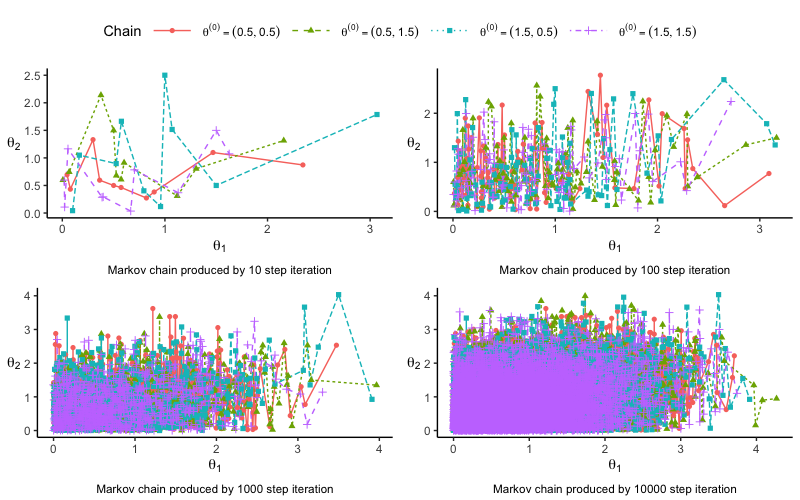
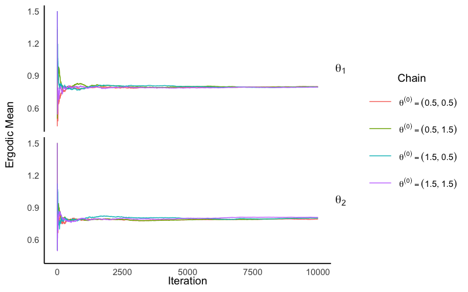
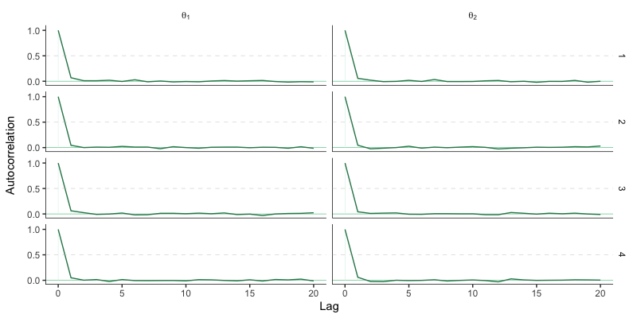
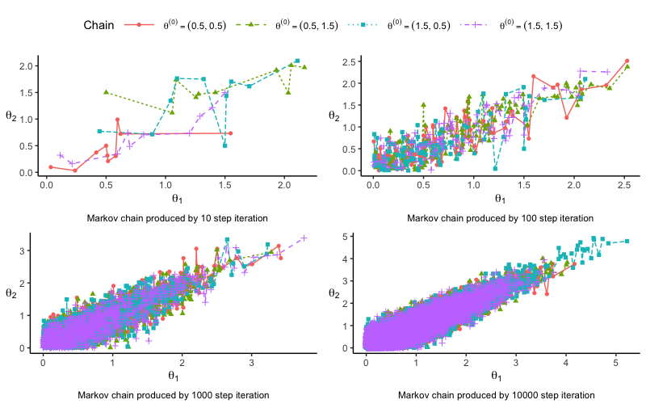
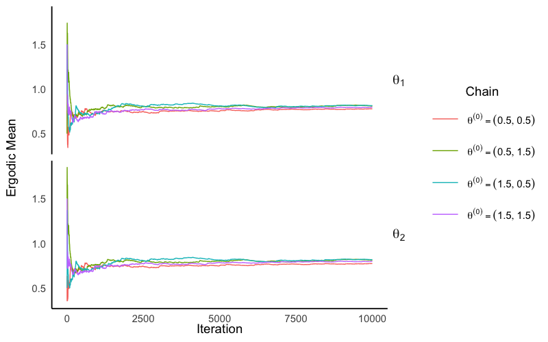
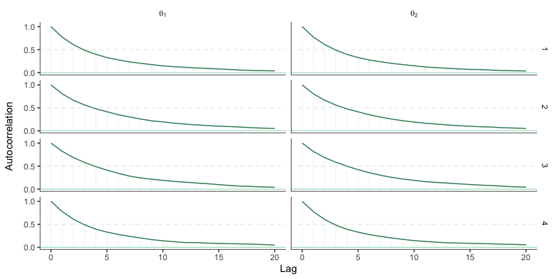
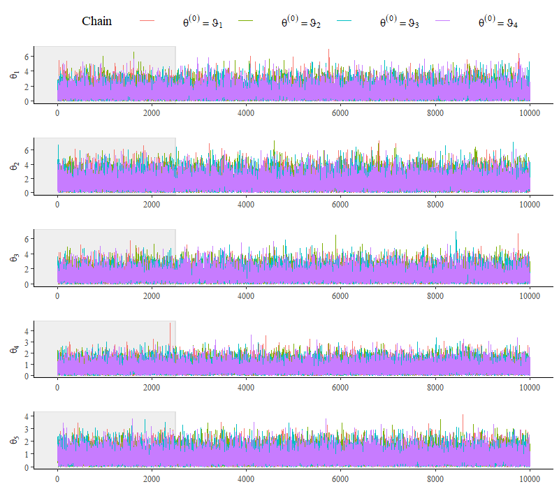
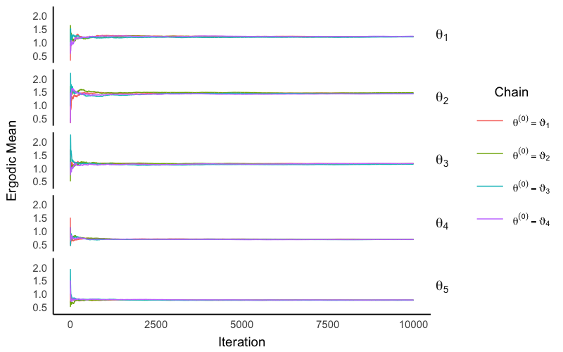
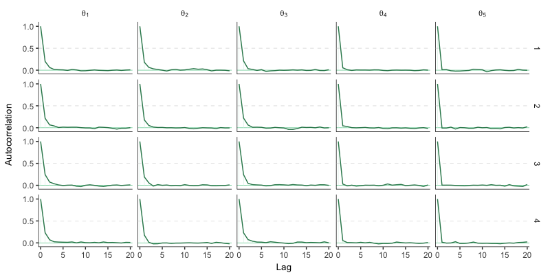

# Folded Normal RNG

# Figures


## R package
```{r message=FALSE,warning=FALSE}
library(MASS)
library(base)
library(dplyr)
library(rstanarm)
library(bayesplot)
library(ggplot2)
library(purrr)
library(tidyr)
library(reshape2)
library(latex2exp)
library(cowplot)
library(ggpubr)
library(ks)
```

## Indicator function of random vector X
```{r}
Indicator <- function(x){
  return(ifelse(FALSE %in% ifelse(x >= 0, TRUE, FALSE), 0, 1))
}
```

## Folded Normal Sampling Funcion
```{r}
FN_Sampling <- function(number, mu, sig){
  sample <- abs(rnorm(number, mean = mu, sd = sqrt(sig)))
  density <- function(x, u, s){
    1/sqrt(2 * pi)/sqrt(s) * (exp(-(x - u)^2/(2 * s)) + exp(-(x + u)^2/(2 * s)) * Indicator(x))
  }
  return(list(sample,density(sample, mu, sig)))
}
```

## Gibbs Sampling Function
```{r}
Gibbs <- function(N,x_init,sig1,sig2,rho){
  x_seq <- matrix(0, N, 2)
  x_seq[1, ] <- x_init
  for (i in 2:N){
    ## x1|x2
    x_seq2 <- x_seq[i - 1, 2]
    x_seq[i, 1] <- FN_Sampling(1, x_seq2 * rho * sig1/sig2, sig1 * (1 - rho^2))[[1]]
    ## x2|x1
    x_seq1 <- x_seq[i, 1]
    x_seq[i, 2] <- FN_Sampling(1, x_seq1 * rho * sig2/sig1, sig2 * (1 - rho^2))[[1]]
  }
  return(x_seq)
}
```

## Input parameters
```{r}
N <- 10000 
Chain_n <- 4
sig1 <- 1
sig2 <- 1
rho <- 0.5
x_initial <- list(first = 0, second = 0, third = 0, fourth = 0)
x_init <- x_initial[[1]] <-matrix(c(0.5, 0.5), ncol = 2)
x_initial[[2]] <- matrix(c(0.5, 1.5), ncol = 2)
x_initial[[3]] <- matrix(c(1.5, 0.5), ncol = 2)
x_initial[[4]] <- matrix(c(1.5, 1.5), ncol = 2)
```

## Simulation 
```{r}
set.seed(1010)
sample_p1 <- sample_p2 <- 0
Chain_all <- list(Chain1 = 0, Chain2 = 0, Chain3 = 0, Chain4 = 0)
t_start <- Sys.time()
for(j in 1:Chain_n){
  result = Gibbs(N,x_init,sig1,sig2,rho)
  Chain_all[[j]] <- result
  if(j == 1){
    sample_p1 <- result[,1]
    sample_p2 <- result[,2]
  }
  else{
    sample_p1 <- c(sample_p1, result[,1])
    sample_p2 <- c(sample_p2, result[,2])
  }
  if(j != Chain_n){
    x_init = x_initial[[j+1]]
  }
}
t_end <- Sys.time()
t_end - t_start
```

## Data in array
```{r}
dim2 <- paste0("chain:", 1:4)
dim3 <- paste0("theta", 1:2)
sample_array <- array(c(sample_p1,sample_p2),c(N,4,2),dimnames = list(NULL,dim2,dim3))
names(dimnames(sample_array)) <- c("Iteration", "Chain", "Parameter")
```

## ergodic mean plot
```{r}
## Ergodic data
Chain_Para1_erg <-
  sample_array[,,1] %>%
  as.data.frame() %>%
  mutate(Iteration=seq_len(N)) %>%
  melt(id.vars = "Iteration", measure.vars = paste0("chain:",1:4),variable.name = "Chain",value.name = "Para") %>%
  group_by(Chain) %>%
  mutate(ergodic_mean = cumsum(Para)/seq_len(N),
         Theta = "theta1") %>%
  as.data.frame()
Chain_Para2_erg <-
  sample_array[,,2] %>%
  as.data.frame() %>%
  mutate(Iteration=seq_len(N)) %>%
  melt(id.vars = "Iteration", measure.vars = paste0("chain:",1:4),variable.name = "Chain",value.name = "Para") %>%
  group_by(Chain) %>%
  mutate(ergodic_mean = cumsum(Para)/seq_len(N),
         Theta = "theta2") %>%
  as.data.frame()
Chain_erg <- 
  Chain_Para1_erg %>% 
  rbind(Chain_Para2_erg) %>%
  mutate(Theta_c = recode(Theta,
                          "theta1" = "theta[1]",
                          "theta2" = "theta[2]")
  )
## Implement ergodic mean plot
Chain_erg %>%
  group_by(Chain) %>%
  # top_n(n = -10000, wt = Iteration) %>%
  ggplot(aes(x=Iteration, y=ergodic_mean, colour=Chain, group=Chain)) +
  facet_grid(rows = vars(Theta_c), labeller = label_parsed) +
  geom_line() +
  theme_minimal(base_size = 14) +
  # geom_hline(aes(yintercept = sqrt(2/pi)), linetype = 5, size = 0.3) +
  theme(panel.grid.major =element_blank(), 
        panel.grid.minor = element_blank(),
        panel.background = element_blank(),
        axis.line = element_line(colour = "black"),
        strip.background = element_rect(
          color = "white", fill = "white"),
        panel.grid = element_blank(),
        legend.key = element_rect(
          color = "white", 
          fill = "white"),
        strip.text.y = element_text(size = 15,angle = 0)) +
  theme(axis.title.x = element_text(margin = margin(r = 20)),
        axis.title.y = element_text(margin = margin(r = 15))) +
  theme(legend.key = element_rect(color = NA, fill = NA),
        legend.key.size = unit(35, "pt")) +
  theme(legend.title.align = 0.5) +
  ylab("Ergodic Mean") +
  scale_color_discrete(labels = c(expression(paste(theta^(0)==group("(",list(0.5,0.5),")"))),
                                  expression(paste(theta^(0)==group("(",list(0.5,1.5),")"))),
                                  expression(paste(theta^(0)==group("(",list(1.5,0.5),")"))),
                                  expression(paste(theta^(0)==group("(",list(1.5,1.5),")")))))
```

## Traceplot
```{r}
## Trace data
Chain_Para1_tra <-
  sample_array[,,1] %>%
  as.data.frame() %>%
  mutate(Iteration=seq_len(N)) %>%
  melt(id.vars = "Iteration", measure.vars = paste0("chain:",1:4),variable.name = "Chain",value.name = "theta1") 
Chain_Para2_tra <-
  sample_array[,,2] %>%
  as.data.frame() %>%
  mutate(Iteration=seq_len(N)) %>%
  melt(id.vars = "Iteration", measure.vars = paste0("chain:",1:4),variable.name = "Chain",value.name = "theta2") %>%
  select(theta2)
Chain_tra <- cbind(Chain_Para1_tra, Chain_Para2_tra)
## Implement
traceplot <- function(data, top_n, cap){
  data %>%
    group_by(Chain) %>%
    top_n(n = -top_n, wt = Iteration) %>%
    ggplot(aes(x=theta1, y=theta2, color=Chain, shape=Chain, linetype=Chain)) +
    labs(caption = cap) +
    xlab(TeX('$theta_{1}$')) +
    ylab(TeX('$theta_{2}$')) +
    geom_line() + 
    geom_point() +
    guides(colour = guide_legend(override.aes = list(shape = c(16, 17, 15, 3), linetype = 1:4))) +
    scale_shape(guide = "none") +
    scale_linetype(guide = "none")+
    theme(panel.grid.major =element_blank(), 
          panel.grid.minor = element_blank(),
          panel.background = element_blank(),
          axis.line = element_line(colour = "black"),
          axis.title.y = element_text(vjust = 0.5, hjust = 0.5, angle = 0),
          plot.caption = element_text(hjust = 0.5, vjust = 0)) +
    theme(legend.key = element_rect(color = NA, fill = NA),
          legend.key.size = unit(35, "pt")) +
    theme(legend.title.align = 0.5) +
    scale_color_discrete(labels = c(expression(paste(theta^(0)==group("(",list(0.5,0.5),")"))),
                                    expression(paste(theta^(0)==group("(",list(0.5,1.5),")"))),
                                    expression(paste(theta^(0)==group("(",list(1.5,0.5),")"))),
                                    expression(paste(theta^(0)==group("(",list(1.5,1.5),")"))))) 
}
tp1 <- traceplot(Chain_tra, 10, "Markov chain produced by 10 step iteration")
tp2 <- traceplot(Chain_tra, 100, "Markov chain produced by 100 step iteration")
tp3 <- traceplot(Chain_tra, 1000, "Markov chain produced by 1000 step iteration")
tp4 <- traceplot(Chain_tra, 10000, "Markov chain produced by 10000 step iteration")
ggarrange(tp1, tp2, tp3, tp4, ncol=2, nrow=2, common.legend = TRUE, legend = "top")
```

##  Eliminating the Burn-in period data(The previous 2500)
```{r}
Elim_n <- 2500
Elim_sub <- c(1:Elim_n, (N + 1):(N + Elim_n), (2 * N + 1):(2 * N + Elim_n),(3 * N + 1):(3 * N + Elim_n))
sample_p1_elim <- sample_p1[-Elim_sub]
sample_p2_elim <- sample_p2[-Elim_sub]
dim2 <- paste0("chain:", 1:4)
dim3 <- c("theta[1]", "theta[2]")
sample_array_elim <- array(c(sample_p1_elim,sample_p2_elim),c(N-Elim_n,4,2),dimnames = list(NULL,dim2,dim3))
names(dimnames(sample_array_elim)) <- c("Iteration", "Chain", "Parameter")
```

## Autocorrelation
```{r}
color_scheme_set("green")
mcmc_acf(sample_array_elim, pars = c("theta[1]", "theta[2]"), lags = 20) + 
  hline_at(0.5, linetype = 2, size = 0.15, color = "grey") + 
  scale_x_continuous(breaks=seq(0, 20, 5), labels = seq(0, 20, 5)) +
  theme(panel.grid.major =element_blank(), 
          panel.grid.minor = element_blank(),
          panel.background = element_blank(),
        strip.background.x = element_rect(fill = "white"),
        strip.background.y = element_rect(fill = "white"),
        axis.title.y = element_text(margin = margin(r = 10))) +
  facet_grid(Chain~Parameter,labeller = label_parsed)
```

## Effective sample size
```{r}
ess_Vari <- function(Chain) {
  C_N <- length(Chain)
  V <- map_dbl(seq_len(C_N - 1),
               function(t) {
                 mean(diff(Chain, lag = t) ^ 2, na.rm = TRUE)
               }
  )
  return(V)
}
ess <- function(Chain_all,Chain_n, para_n){
  V = 0
  para_all = c(0)[-1]
  for(i in 1:Chain_n){
    V = V + ess_Vari(Chain_all[[i]][(Elim_n+1):N,para_n])
    para_all = c(para_all,Chain_all[[i]][(Elim_n+1):N,para_n])
  }
  rho <- head_while(1 - V / var(para_all), ~ . > 0)
  (N-Elim_n)*Chain_n / (1 + sum(rho))
}
ess_para1 <- ess(Chain_all,4, 1) # the ess of 4 chains(theta1): 30000
ess_para2 <- ess(Chain_all,4, 2) # the ess of 4 chains(theta2): 30000
ess_para1 
ess_para2 
```

## Compare MCMC estimates to "true" parameter values 
```{r}
sample_rbind_para <- rbind(sample_array_elim[,1,],
                           rbind(sample_array_elim[,2,],
                                 rbind(sample_array_elim[,3,],
                                       sample_array_elim[,4,])))
rep(sqrt(2/pi), 2) # true_mean
rep(sqrt(1 - 2/pi), 2) # true_sd 
0.8809167 # true_rho
apply(sample_rbind_para, 2, mean) # est_mean
apply(sample_rbind_para, 2, sd) # est_sd
cor(sample_rbind_para[,1], sample_rbind_para[,2]) # est_rho
```

## MCSE 
```{r}
## theta1
sd(sample_rbind_para[,1])/ess_para1
## theta2
sd(sample_rbind_para[,2])/ess_para2
```

## PSRF: R^hat
```{r}
sample_cbind_para <- cbind(sample_array_elim[,1,],
                           cbind(sample_array_elim[,2,],
                                 cbind(sample_array_elim[,3,],
                                       sample_array_elim[,4,])))
J = 4
L = N-Elim_n
col_index <- matrix(0,length(x_init),Chain_n)
for(j in 1:length(x_init)){
  col_index[j,] <- which(colnames(sample_cbind_para) == colnames(sample_rbind_para)[j])
}
for(j in 1:length(x_init)){
  x_j_mean <- apply(sample_cbind_para, 2, mean)[col_index[j,]]
  x_mean <- apply(sample_rbind_para, 2, mean)[j]
  B <- L/(J-1) * sum((x_j_mean - x_mean)^2)
  sj2 <- 1/(L-1) * apply((sample_cbind_para[,col_index[j,]] - x_j_mean)^2,2,sum)
  W <- 1/J * sum(sj2)
  R <- ((L-1)/L * W + 1/L * B + B/(L*J))/W
  print(R)
} 
```

## REM
```{r}
sum(abs(rep(sqrt(2/pi), 2) - apply(sample_rbind_para, 2, mean)))/sum(abs(rep(sqrt(2/pi), 2)))
```

## Two Dimension Case FN(0, ρ = 0.5)


| Type | Plot |
|:----|:----|
| **Trace Plot** |   |
| **Ergodic Mean Plot** |  |
| **ACF Plot** | |

## Two Dimension Case FN(0, ρ = 0.95)

| Type | Plot |
|:----|:----|
| **Trace Plot** |   |
| **Ergodic Mean Plot** |  |
| **ACF Plot** | |


## Five Dimension Case FN(0,I)

| Type | Plot |
|:----|:----|
| **Trace Plot** |   |
| **Ergodic Mean Plot** |  |
| **ACF Plot** | |
